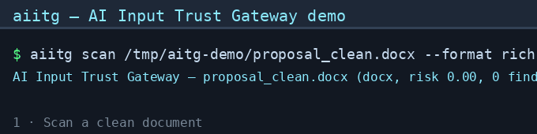

# AI Input Trust Gateway (aiitg)

**The zero-trust input security layer for AI agents.** Scan untrusted documents before they reach an LLM — detect hidden prompt-injection content, sanitize it, label its trustworthiness, and enforce policy. **External content is data, never authority.**

[]()
[]()
[]()
[]()

---

## Why

2025–2026 research and real-world incidents repeatedly demonstrated a class of attack: **instructions hidden inside documents that humans cannot see, but LLMs read and obey.**

- **Peer-review manipulation**: authors hide prompts in manuscripts to make AI reviewers give top scores (arXiv:2507.06185, 2508.20863, 2509.09912)
- **Resume injection**: hidden instructions in resumes force AI screeners to "must hire" (arXiv:2605.28999)
- **Agent hijacking**: hidden text in PDFs/web pages makes AI assistants leak secrets or execute dangerous actions

The document a human sees and the document an LLM reads can be **completely different** — that's the **Human-AI Visibility Gap**. This project turns that gap into auditable evidence.

## Demo



*Scan → trust label → sanitize → policy. A document with a hidden zero-width instruction is detected, labeled `dangerous`, sanitized, and blocked by policy before it can reach an LLM.*

## What it does

```
Untrusted input (docx/xlsx/xls/pdf/html/pptx)
        │
        ▼
┌───────────────────────────────────────────────┐
│  FormatRegistry → parser → ParsedDocument      │
│  (format-agnostic intermediate model)          │
│                                               │
│  Detector chain (7 detectors)                 │
│  → Evidence list (coordinate-level)           │
│                                               │
│  Sanitizer (strip / redact)                   │
│  → Safe text for LLM context                  │
│                                               │
│  Trust label (safe / caution / dangerous)     │
│  Policy engine (allow/quarantine/approval/    │
│                  block)                       │
│  → Decision + audit log + human approval      │
└───────────────────────────────────────────────┘
        │
        ▼
   Safe LLM/Agent consumption
```

### The pipeline (M0 → M1 → M2)

| Stage | Capability | Interface |
|---|---|---|
| **M0** | Hidden content audit — 6 formats × 7 detectors → coordinate-level JSON evidence | `aiitg scan` |
| **M1** | Sanitization (strip/redact) + trust labeling (safe/caution/dangerous) | `aiitg sanitize`, `aiitg trust` |
| **M2** | Policy enforcement (allow/quarantine/human_approval/block) + audit + human-approval queue + **MCP server** for agent frameworks | `aiitg policy`, `aiitg audit`, `aiitg approvals`, `aiitg-mcp` |

### Detectors

| ID | Name | Detects | Severity |
|---|---|---|---|
| DET-001 | zero_width | Zero-width / invisible Unicode (U+200B, U+2060, U+FEFF…) | HIGH |
| DET-002 | hidden_style | White text, transparency, `display:none`, `w:vanish` | HIGH |
| DET-003 | tiny_font | Extremely small font (≤2pt) | MEDIUM |
| DET-004 | hidden_sheet | Hidden sheets/rows/columns (with data) in xlsx/xls | MEDIUM |
| DET-005 | ooxml_nodes | OOXML hidden nodes (tracked-delete, altChunk, comments) | MEDIUM |
| DET-006 | annotations | Word comments, PDF annotations, HTML comments | LOW |
| DET-007 | document_meta | Metadata / VBA macros / JS signals | LOW |

### Formats

`docx` · `xlsx` · `xls` (legacy) · `pdf` · `html` · `pptx`

## Install

```bash
uv venv .venv && uv pip install -e ".[dev]"
# or
pip install -e ".[dev]"
```

## Usage

### Scan

```bash
aiitg scan report.docx --format json        # JSON evidence report
aiitg scan report.xlsx --min-severity high  # only high+ findings
aiitg scan report.pdf --format rich         # terminal table
aiitg scan ./inbox --recursive --jsonl      # batch directory scan
aiitg list-detectors                        # list all 7 detectors
```

Exit codes: `0` = clean · `1` = findings at/above threshold · `2` = usage error · `3` = parse error (CI-friendly).

### Sanitize + trust label (M1)

```bash
aiitg sanitize report.docx                  # strip hidden content → safe text
aiitg sanitize report.docx --mode redact    # replace with [REDACTED]
aiitg trust report.docx                     # safe / caution / dangerous
```

### Policy + audit + approvals (M2)

```bash
aiitg policy report.docx --format rich      # allow / quarantine / human_approval / block
aiitg policy report.docx --audit audit.jsonl
aiitg audit audit.jsonl --format rich       # append-only JSONL audit trail
aiitg approvals queue.jsonl                 # list pending approvals
aiitg approvals queue.jsonl --action approve --id <id>
```

### Agent integration (MCP)

```bash
aiitg-mcp                                   # stdio transport (Claude Code / Codex / OpenCode)
aiitg-mcp --transport http                  # streamable HTTP
```

Agents call `policy_file` **before** feeding untrusted content into context; anything non-`allow` gets blocked/sanitized/human-approved.

## Library

```python
from ai_input_trust_gateway import process_file

result = process_file("report.docx")
if result.is_blocked:
    human_review(result.report)              # escalate to approval queue
elif result.decision.action.value == "quarantine":
    llm_context = result.sanitized.text      # sanitized text is safe
else:
    llm_context = result.sanitized.text      # allow
```

## Design principles

1. **External content is data, never authority.** Documents are parsed, sanitized, and policy-checked before ever becoming instructions.
2. **Assume compromise.** Detection is never 100%; isolation + least privilege + evidence + human approval + audit are the real defense.
3. **Detector/format decoupling.** Detectors consume a format-agnostic `ParsedDocument`; new format = new parser, new attack = new detector.
4. **Coordinate-level evidence.** Every finding carries exact location (paragraph/run/sheet/row/page/char_range) for forensics and sanitization.
5. **Conservative trust caps.** Any evidence of deliberate concealment can never yield `safe`; HIGH/CRITICAL concealment can never yield better than `dangerous`.

## Research grounding

- arXiv:2507.06185 — *Hidden Prompts in Manuscripts Exploit AI-Assisted Peer Review*
- arXiv:2508.20863 — *Misleading LLMs in Peer-Reviewing via Hidden Prompt-Injection*
- arXiv:2509.09912 — *When Your Reviewer is an LLM: Prompt Injection Risks in Peer Review*
- arXiv:2605.28999 — *Real-World Prompt-Injection Attacks in LLM-based Resume Screening*

## Testing

```bash
make test        # 102 tests
make lint        # ruff
make typecheck   # mypy
```

Malicious test fixtures are **generated in code** (never committed as binaries) — reproducible, auditable, diff-friendly.

## Roadmap

- [x] **M0** — Hidden content audit (6 formats × 7 detectors → coordinate-level evidence)
- [x] **M1** — Sanitization + trust labeling (scan → sanitize → label closed loop)
- [x] **M2** — Policy enforcement + audit + human approval + MCP server (agent gateway)
- [ ] More formats (legacy `.doc`, `.ppt`, images via OCR) · multi-policy engine · distributed audit · benchmark dataset for hidden-injection detection

## License

MIT
